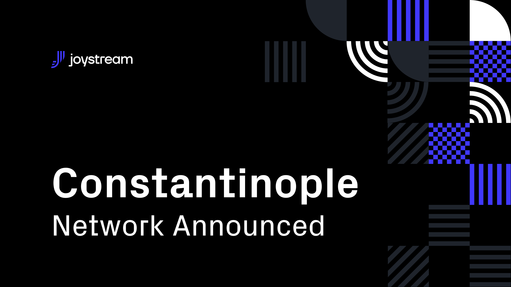

# Post

#### Title

Announcing Constantinople

#### Purpose

Sharing plans for our upcoming Constantinople testnet

#### url

blog.joystream.org/announcing-constantinople/

#### Cover

#### Lead

After the successful launch of the Rome testnet in late March, we have already begun work on our next release, codenamed Constantinople.

#### Body

---

## What is Constantinople?

Constantinople will be a considerably smaller release than Rome in terms of scope and technical complexity, with no new roles introduced and no major changes to the testnet structure. 

The focus of Constantinople will rather be on the governance side of our project, with features introduced aimed at enhancing this (up until now) rather neglected but fundamental dimension of the Joystream vision.

As part of this, there are two major changes which will differentiate Constantinople from Rome:

1) A new proposal system
2) A fiat-backed token compensation scheme for platform actors

### New Proposal System
One very important change will be a new proposal system. While our current system allows the council to vote on runtime upgrades, the new version will be considerably more advanced. Among other things, participants will be able to make proposals on how to spend platform funds (backed by USD), whether to kick storage providers, whether to mint new tokens, setting leads for roles and more.

### Fiat-Backed Token Model

Another very important change for Constantinople will be the introduction of a fiat-backed compensation system for platform actors. We hope this more dynamic compensation system, rewarding community participation, should benefit the project in the long run.

Read more about the token model [here](https://github.com/Joystream/joystream/issues/171).

## Shorter Release
We are aiming to release Constantinople in approximately six weeks, so you should expect relatively minor changes to the fabric of the testnet when compared to Rome (which took almost nine months). Nonetheless, we hope the important changes to the governance system mentioned above should make Constantinople a more exciting and dynamic platform.

If you would like to see how we're progressing with development of Constantinople, please take a look at our [GitHub projects](https://github.com/orgs/Joystream/projects).

## Take Part
As was the case with previous testnets, our community will be strongly encouraged to take part. Roles available for Constantinople will include: `Validator`, `Council Member`, `Storage Provider`, `Content Creator` and `Content Curator`.

If you want general information about current and future roles on the Joystream network, go [here](https://www.joystream.org/roles) to read more, and sign up for the newsletter of the roles you find appealing.

Guides for particpating in the active roles are also available in the [helpdesk repo](https://www.github.com/joystream/helpdesk).

---

#### Disclaimer

All forward looking statements, estimates and commitments found in this blog post should be understood to be highly uncertain, not binding and for which no guarantees of accuracy or reliability can be provided. To the fullest extent permitted by law, in no event shall Joystream, Jsgenesis or our affiliates, or any of our directors, employees, contractors, service providers or agents have any liability whatsoever to any person for any direct or indirect loss, liability, cost, claim, expense or damage of any kind, whether in contract or in tort, including negligence, or otherwise, arising out of or related to the use of all or part of this post, or any links to third party websites.

#### Preview

https://blog.joystream.org/p/bf4e9d4b-9310-4b3f-9d0d-a3ab8c378cd5/

#### Social media card cover

#### Social media excerpt

Since the succesful launch of the Rome testnet in late March, we have begun work on our next release, codenamed Constantinople.
