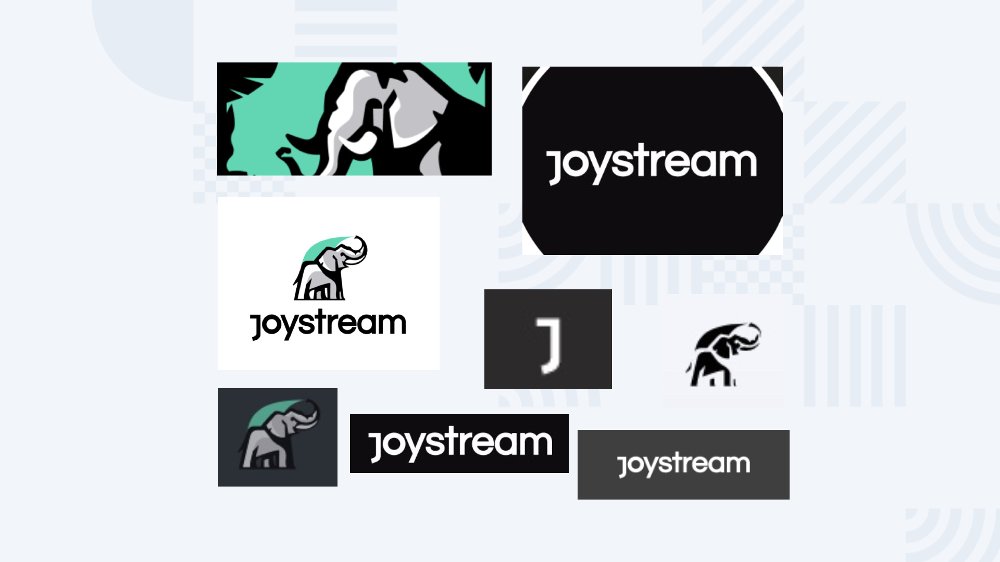
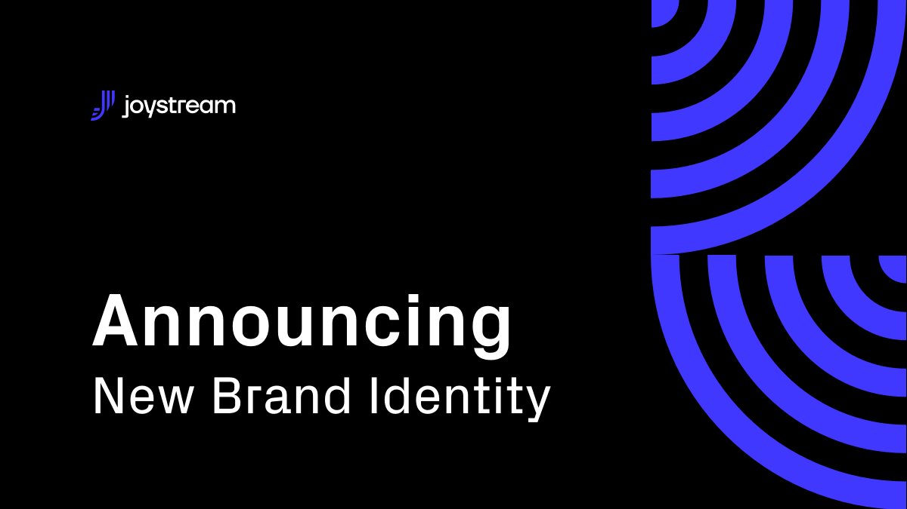

# Post

#### Title

Announcing New Brand Identity

#### Purpose

Let our community know about our new brand identity.

#### url

blog.joystream.org/announcing-new-branding/

#### Cover

<p align="center"></p>

#### Lead

We're very excited to announce the rollout of our new brand identity which will be taking place over the next couple of days!

#### Body

The Problem
-----------

Before the process of developing our new brand identity had begun, we were frustrated by the fact that the Joystream visual identity was lacking in many respects. It was incomplete and undefined, which led to problems in communication with our audience across all of our channels, products and messages.



The problems we faced in this area included but were not limited to:

-   The logo was inconsistent (sometimes it was our old elephant logo, sometimes a wordmark, sometimes an emblem and occasionally combinations of all three)
-   Logo usage guidelines were unclear in terms of positioning, backgrounds, etc.
-   Key brand colors and typefaces were undefined
-   There were no rules for photo style or illustration style in our communications (e.g. blog posts)
-   Icons and other assets lacked a consistent style
-   Assets for certain purposes simply did not exist
-   We had no established brand design guidelines or a style guide

You can see [more of our discussion](https://github.com/joystream/design/issues?q=is%3Aissue) about these issues in our design repo on GitHub.

The Solution
------------

We could see that an urgent solution was necessary to tackle the issues we faced with our branding. As a result, we got in contact with a team of talented designers who were able to completely overhaul our visual brand identity. This was a complicated process which lasted for an extended period of time, but we are very pleased with the results which are now ready to be deployed across our profiles and web properties.

Overall, our rebranding project involved:

-   Designing a new Joystream logo
-   Determining our brand colors and fonts
-   Redesigning our main website (joystream.org)
-   Creating new assets for our social media profiles
-   Creating new assets for our GitHub repositories
-   Redesigning our blog and the assets used for blog posts
-   Designing assets to be used in advertising
-   Creating a "style guide" for Joystream

Most of these changes will be pushed over the next few days. We hope that our community and stakeholders will be pleased with what they see!

The Results
-----------

Instead of using this post to show you *all* of the new assets, logos and icons which you can expect to see deployed across our public-facing profiles and products, we thought it might be more helpful to share with you our new `Branding Guide`. This document offers a visual overview of the changes to the Joystream brand and provides some useful context and information about our new asset types.

```


EMBEDDED PDF HERE


```

If you're using an older web browser, the PDF might not display correctly. If this is the case, please click [here](http://151.236.222.69/assets/brandguide.pdf) to download the guide and view it locally on your device.

<!--- REPLACE LINK ABOVE ON PUBLICATION --->

* * * * *

#### Disclaimer

All forward looking statements, estimates and commitments found in this blog post should be understood to be highly uncertain, not binding and for which no guarantees of accuracy or reliability can be provided. To the fullest extent permitted by law, in no event shall Joystream, Jsgenesis or our affiliates, or any of our directors, employees, contractors,  service providers or agents have any liability whatsoever to any person  for any direct or indirect loss, liability, cost, claim, expense or  damage of any kind, whether in contract or in tort, including negligence, or otherwise, arising out of or related to the use of all or  part of this post, or any links to third party websites.

#### Preview

http://151.236.222.69/p/dca19604-608b-4d30-bca5-34542a545eed/

<!--- REPLACE LINK ABOVE ON PUBLICATION --->

#### Social media card cover

<p align="center"></p>

#### Social media excerpt

Check out our new brand identity!
