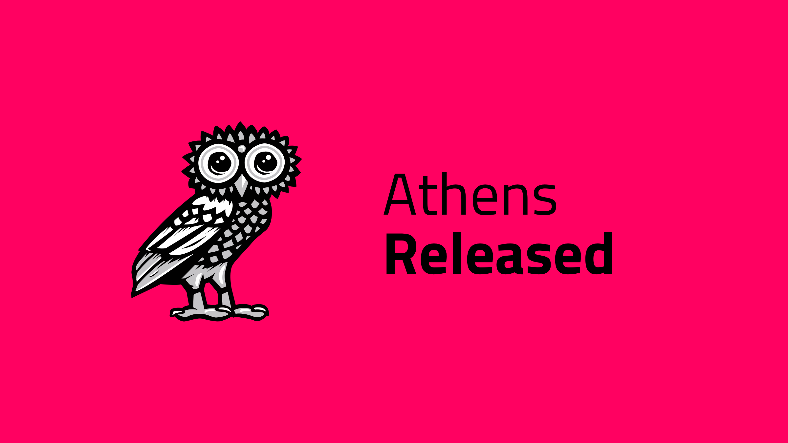

# Post

#### Title

Athens Released

#### Purpose

Announce Athens Launch

#### url

blog.joystream.org/athens-released/

#### Cover

#### Lead
After a "Soft" release this Monday, we are officially launching the Athens testnet! You can consume and upload content, and get paid in Monero to take on a variety of roles.

Short excerpt:
Athens launched with content enabled!
Get paid in monero to contribute.

#### Body

Get Paid to Participate
-----------------------

In a previous [post](https://blog.joystream.org/pay-for-play/), we explained the philosophy of why we are paying users to contribute on our testnet.

In our last post, we outlined the incentive structure for Athens. The specifics of this is also available in our new [helpdesk repo](https://github.com/JoyStream/helpdesk).

Participants can earn Monero

**The following roles qualifies for rewards:**

1.  `Validators]`
2.  `Council Members`
3.  `Storage Providers` (new)
4.  `Builders and Bug Reporters`

Get Started
-----------

If you just want to have a look at the new testnet, go [here](http://testnet.joystream.org/). If you need any help getting started, we ask you to consult our [helpdesk repo](https://github.com/JoyStream/helpdesk) first. If you have further questions, post them as `Issues` there, or ask in our [Telegram](https://t.me/JoyStreamOfficial)!

With a lot of changes since our last testnet, this applies just as much to old and new participants.

New Features
------------

The two main new features of Athens compared to our previous testnet, [Sparta](https://blog.joystream.org/sparta/), is the introduction of platform `Memberships` , and media content. The latter also unlocks the new role of `Storage Providers`.

### Memberships

Obtaining a `Membership` unlocks certain features, such as taking part of the platform governance system. So if you want to be `Council Member`, vote in the election, or create `proposals`, you have to become a member first. It is a requirement for the `Storage Provider` role, and for uploading content to the platform.

### Content

As a user governed video platform, introducing content was an important step to us. There are **currently** no requirements to download content, or consume it in the browser, but as stated above, uploads requires a `Membership`.

Paid Roles
----------

Below you will find a short description of the paid roles for [Athens](https://testnet.joystream.org), and links to the incentives and instructions for taking on the role.

#### Validators

Compete for $30 per week

The `validator` role is the block producer in our proof of stake blockchain. It is a little more complex to set up this time around, as you need three different `keys` in the process. Chances are you will not succeed unless you follow the steps [here](https://github.com/Joystream/helpdesk/tree/master/roles/validators).

If you still want to try yourself, the main pitfall is that the `session` key (the one you give your node to sign blocks) **must** be an `Edwards` key, not `Schnorrkel`.

You can find the incentive structure [here](https://github.com/Joystream/helpdesk#validators).

#### Council Members

Earn $8 per election cycle

The `Council Member` are at the core of the platform governance. Elected by the users/stakeholders, they are the ones voting for proposals on platform improvements. A guide through the election cycle can be found [here](https://github.com/Joystream/helpdesk/tree/master/roles/council-members).

The only difference as compared to Sparta, is that we now require both applicants and voters to be `Members` of the platform.

You can find the incentive structure [here](https://github.com/Joystream/helpdesk#council-members).

#### Storage Providers

Compete for $75 per week, plus bonus

The job of new `Storage Providers` role is to receive and distribute content to consumers in a P2P fashion. The role is a little challenging to setup and maintain, so the guides and support will not be as verbose as for the other roles. You *can* signup for the role already, but syncing between the `Storage Providers` have proved more challenging than we anticipated. If you do signup, but fail to take the necessary steps to perform the role when all is working, you will get booted.

You can find the incentive structure [here](https://github.com/Joystream/helpdesk#storage-providers).

#### Builders and Bug Reporters

Earn up to $20 for Issues, and $100 for PRs

As with all software, and especially the early versions, there will be plenty of bugs, enhancements and missing features. Both to improve as we go, and to "train" a group of testers and developers for an autonomous platform, we want outsiders to contribute already. You can learn more about the process here.

You can find the incentive structure here.

#### Disclaimer

All forward looking statements, estimates and commitments found in this blog post should be understood to be highly uncertain, not binding and for which no guarantees of accuracy or reliability can be provided. To the fullest extent permitted by law, in no event shall Joystream, Jsgenesis or our affiliates, or any of our directors, employees, contractors,  service providers or agents have any liability whatsoever to any person  for any direct or indirect loss, liability, cost, claim, expense or  damage of any kind, whether in contract or in tort, including negligence, or otherwise, arising out of or related to the use of all or part of this post, or any links to third party websites.

#### Preview

https://blog.joystream.org/p/c1a02ccf-6f7d-4b63-8632-1be70a5700ce/

#### Social media card cover

#### Social media excerpt
