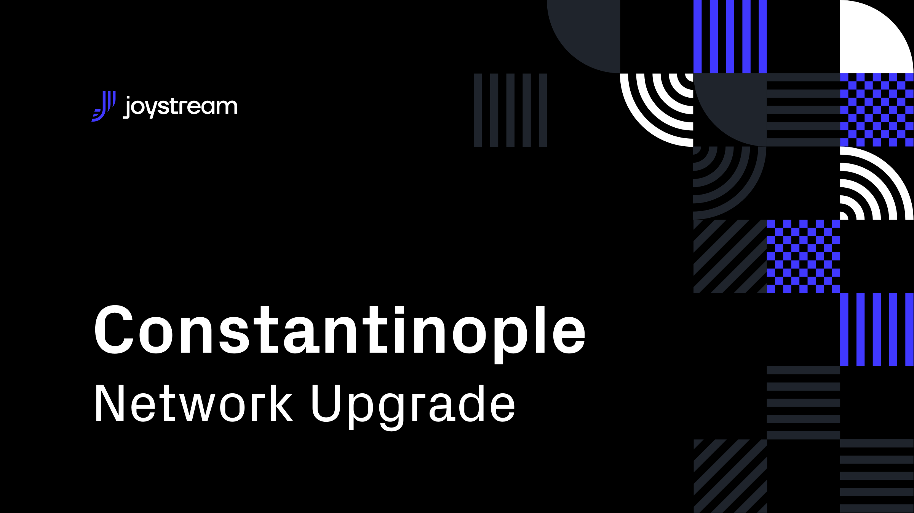

# Post

#### Title

Constantinople Upgrade

#### Purpose

Inform users about Nicaea Upgrade

#### url

blog.joystream.org/constantinople-upgrade/

#### Cover

#### Lead
The upcoming runtime upgrade will primarily affect the storage providers, by placing them in a new working group with a lead.

#### Body

At approximately 1300GMT this Wednesday, or blockheight ~1914000, a runtime upgrade of the Joystream testnet will take place.

Perhaps the most noticeable changeis that the Storage Provider role will now be part of a dedicated working group, with a Lead hired by the Council. This platform actor is hired by the council through an on-chain application process which relies on the proposals system.

Once hired, this actor is responsible for hiring, firing, and managing Storage Providers, and the group's resources as allocated by the Council.

As a consequence of this, all existing Storage Providers will be fired, and must apply to the Council in order to become the Lead, or to the Lead (once elected) to become Storage Providers.

This change aims to further promote the autonomy of the platform (particularly the Council) and we hope this will yield some interesting results!

### New Proposals

With this change, all the existing proposal types connected to the Storage Provider role have been deprecated, and some new ones have been added.

### New Command-Line Interface

Another of the important "upgrades" to Constantinople included in the sub-release is the introduction of a new command-line interface (CLI) for interacting with the Joystream network. It has a fairly limited scope for now, as its main purpose is to enable the Storage Lead to create and manage role openings. It may also be useful for participants on account of its other features, such as the transfer of funds.

### Upgrade Process

As described [here](https://testnet.joystream.org/#/proposals/40), the upgrade will be made with the sudo key. This is unfortunate, but due to some poor planning on our side, we asked for an informal permission to perform the runtime upgrade this way, to ensure the new system is rolled out without further delay.

### Join the Network

Historically, the Storage Provider role has been very popular on the incentivized Joystream testnets, and many users have not had the chance to join. As this is a fresh start for this working group, now would be an opportune moment to get involved.

For information about the fiat-backed incentives scheme in general, see [this old blog post](https://blog.joystream.org/constantinople-incentives/). For information about how you can join as a Storage Provider, or other roles, consult our [helpdesk repo](https://github.com/Joystream/helpdesk). Please note that some of the information here will be updated in between the release of this post and runtime upgrade.

If you just want to have a look at the new testnet, go [here](http://testnet.joystream.org/). If you need any help getting started, we ask you to consult our [helpdesk repo](https://github.com/Joystream/helpdesk) first. If you have further questions, post them as `Issues` there, or ask in our [Telegram](https://t.me/JoyStreamOfficial)!

Testnet Tokens (tJOYs) can be requested through our [Telegram group](https://t.me/JoyStreamOfficial) for those who are new to the project or are looking to play a more active role within our nascent community.

#### Disclaimer

All forward looking statements, estimates and commitments found in this blog post should be understood to be highly uncertain, not binding and for which no guarantees of accuracy or reliability can be provided. To the fullest extent permitted by law, in no event shall Joystream, Jsgenesis or our affiliates, or any of our directors, employees, contractors,  service providers or agents have any liability whatsoever to any person  for any direct or indirect loss, liability, cost, claim, expense or  damage of any kind, whether in contract or in tort, including negligence, or otherwise, arising out of or related to the use of all or  part of this post, or any links to third party websites.

#### Preview

https://blog.joystream.org/p/c0ca40a0-4cc1-4946-a7eb-a2ab0749437b/

#### Social media card cover

#### Social media excerpt

Constantinople is being upgraded - come and explore some of the changes to expect!
