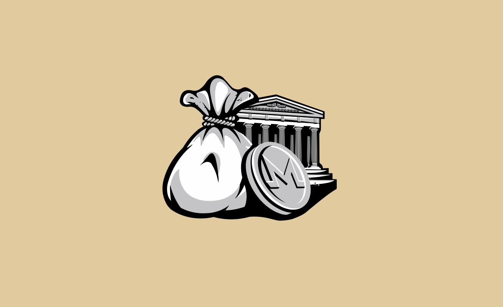

# Post

#### Title

The Acropolis Incentive Structure

#### Purpose

Explain the new incentive structure of Acropolis.

#### url

blog.joystream.org/acropolis-incentives/
blog.joystream.org/p/69074918-d79f-41d2-84d2-95bf71f92588/

#### Cover

<p align="center"></p>
<p align="center"></p>
<p align="center"></p>

Leaning towards `#2`

#### Lead

As with Sparta and Athens we will continue to pay users in monero to participate on our upcoming testnet, Acropolis. In order to boost participation, we are increasing the payouts!

Short excerpt:

Earn more monero on Acropolis!

#### Body

As with [Sparta](https://blog.joystream.org/sparta-incentives-structure/) and [Athens](https://blog.joystream.org/athens-incentives/) we will continue to pay users in monero to participate on our upcoming testnet, Acropolis. In order to boost participation, we are increasing the payouts!

## TL;DR


-   `Storage Providers` are competing for $300 per week, plus $0.025/GB per week
-   `Validators` are competing for $50 per week
-   `Council Members` are paid $10 for getting elected, with a $10 bonus
-   `Bug Reporters` can earn up to $20/$100 for an `Issue`/ `PR`

## Who, Why, What and How?


As for previous testnets, anyone **who** wants to can participate on Acropolis and earn monero, but there is some extra help and guidance for those that ask for it in our [Rocket.Chat](https://chat.joystream.org/home) and [Telegram](https://t.me/joinchat/CNyeUxHD9H56m3e_44hXIA).

The philosophy behind **why** was discussed in detail in a previous [post](https://blog.joystream.org/pay-for-play/). In short, we are paying to prepare active participants for an autonomous platform, and test the incentive structure with "real money".

**What** you can do to qualify for getting paid on Acropolis is described below.

More information, guides on **how** to get setup and extra support can be found in our [helpdesk](https://github.com/Joystream/helpdesk) repo on [github](https://github.com/Joystream/).

#### Paid Roles

-   [`Storage Provider`](#storage-providers)
-   [`Validator`](#validators)
-   [`Council Member`](#council-members)
-   [`Bug Reporter`](#bug-reporters)

If you find one or more of these roles interesting, or want to learn about future roles on the network, we encourage you to visit the new [roles](https://www.joystream.org/roles) section on our website. Here you can browse through them, and get a sense of what they will mean to the network, along with responsibilities and requirements.

You can also sign up for role specific newsletters, that will keep you updated on development and incentives!

## Storage Providers


Compete for $300 per week, plus bonus

Although we first introduced [media content](https://testnet.joystream.org/athens/pioneer/#/media) on the platform with Athens, the `Storage Provider` role was never really activated. We decided to release the testnet on schedule, although the [storage node](https://github.com/Joystream/storage-node-joystream) had a bug so the content was not synchronized between the nodes and the Jsgenesis team node acted as both a hardcoded liason (upload recipient) and the single source for downloads. After proper debugging, we decided to rewrite large parts of it, and delay proper functionality for Acropolis. Note that we the first 10 to sign up were compensated as promised, but the node didn't really do anything.

For Acropolis, this has been sorted out, and the Jsgenesis node(s) will not have any special privileges or priority.

Unlike `Validators` that can come and go without too much friction (at least for now), a new `Storage Provider` will need to replicate the entire content directory. As a consequence, the platform needs some stability for this role to avoid providing a poor user experience, or worse, loss of data. After migrating to the new Acropolis [runtime](https://blog.joystream.org/upgrades/), the users that currently hold the role will get "kicked" out, and will have to sign up again if they still want to keep their role.

Up to 10 `Storage Providers` that keeps a full copy and provides continues service for at least 24h will compete for $300 per week. In addition,  you will earn a $0.025/GB/week calculated on an average basis. Please note that the setup is a lot more complicated this time, so some experience using linux on the command line is required. You will also need a URL to point to your node, so you need to buy or use a domain you already own... A detailed guide to setting up the node can be found [here](https://github.com/Joystream/helpdesk/tree/master/roles/storage-providers).

We will try our best to police the `Storage Providers`, so if you are not doing your job (either lack of maintenance, or cheating) at least make sure to not get caught! Payouts will be made every Monday at ~11:00GMT.

## Validators


Compete for $50 per week

In proof of stake systems, block producers, or `Validators`, are typically paid a fixed amount for each block produced. Due to some connectivety issues we had for a while, the `Validator` nodes was often getting booted. Because of this, we are increaseing the payout pool from $30 to $50 per week.

```
blocktime = 6
weekly_reward = 5000
seconds_in_week = 60*60*24*7

blockreward = (weekly_reward * blocktime)/seconds_in_week
print(blockreward)

----

0.05
```

The number - 0.05 cents per block - seems a bit underwhelming, but validation requires little effort for the user after setup, and blocks come in every 6secs. With armv7 binaries or low-end VPS nodes, it should be cheap to run! A detailed guide to setting up the `Validator` node and settings can be found [here](https://github.com/Joystream/helpdesk/tree/master/roles/validators).

Payouts will be made every Monday at ~11:00GMT.

## Council Members


Earn $10 per election cycle

`Council Members` are elected by the stakeholders in the system to act in the interest of their constituency. Somewhat simplified, the Council will allocate the platforms resources, and hire executive personnel to run the day to day.

We are looking at how to best incentivize them to act in the platforms long term interest. As this position generated less interest than we anticipated, we are tweaking the incentives by increasing the payout to get elected from $8 to $10.

If during you term a proposal to upgrade the runtime is submitted by the `sudo` key, `5CJzTaCp5fuqG7NdJQ6oUCwdmFHKichew8w4RZ3zFHM8qSe6` anyone that votes yes will receive a bonus worth $10. A detailed explanation the election cycle and responsibilities can be found [here](https://blog.joystream.org/sparta/#council-member).

During the `Announcement` and `Voting` stage, you should include some information about yourself, and why you should get elected in your `memo` field. If you do get elected, make sure to change the `memo` field to your monero address in order to get your reward.

Payouts will occur at ~11:00GMT the day after the election/vote.

## Bug Reporters and Builders


Earn monero for to report bounties or fix bugs!

Unlike the `Validators` and `Council Members`, the bug bounty payments will be somewhat subjective. Long term, such decisions will be resolved by the platform, so in future testnets these payouts will at least partially be made by the Council.

We have recently made a [bounties repo](https://github.com/Joystream/bounties) where you can find specific tasks and their rewards, and we will add more bounties and evolve the system as we grow. In addition to the bounties we propose, we are always looking for suggestions for bounties from the community.

If you find a bug, potential improvement, or just an idea, there are a couple of ways to earn your reward:

### Report a software bug

Go to the applicable technical repo(s), eg. [node repo](https://github.com/Joystream/substrate-node-joystream), [Pioneer repo](https://github.com/Joystream/apps/tree/joystream),  [storage node repo](https://github.com/Joystream/storage-node-joystream), [runtime-repo](https://github.com/Joystream/substrate-runtime-joystream), etc. and make an `Issue`. You will be compensated based on the importance and "quality", the latter of which is measured from the level of details in general, like how to reproduce, pasted log outputs, etc.

#### Errors in the helpdesk guides (or a non-code repo)

If you find something missing, inaccurate or poorly described, either report an `Issue`, or even better, make a `Pull request` in the [helpdesk repo](https://github.com/Joystream/helpdesk).

If what you have found is from another non-code repo, eg. [landing repo](https://github.com/Joystream/joystream), [communications repo](https://github.com/Joystream/communications),  [bounties repo](https://github.com/Joystream/bounties), etc. it will most likely be covered by [this bounty](https://github.com/Joystream/bounties/issues/3). Note that the bar here is quite low (grammar, dead links, etc.) so more significant findings can lead to a lot larger payouts.

#### Fix a software bug, or add/improve a feature

If you want, you can just make a PR directly, and your contribution will be compensated. If it's an extensive job though, it would be best for all parties if you propose a bounty yourself as outlined [here](https://github.com/Joystream/bounties#proposals). We could then agree on terms in advance, so no one will be left disappointed.

#### Collect your bounty

The contributor must include either their Joystream or monero address when submitting the issue/PR. If you choose the former, you must then make sure the add your monero address to the `memo` field of your Joystream address.
---

#### Disclaimer

All forward looking statements, estimates and commitments found in this blog post should be understood to be highly uncertain, not binding and for which no guarantees of accuracy or reliability can be provided. To the fullest extent permitted by law, in no event shall Joystream, Jsgenesis or our affiliates, or any of our directors, employees, contractors,  service providers or agents have any liability whatsoever to any person  for any direct or indirect loss, liability, cost, claim, expense or  damage of any kind, whether in contract or in tort, including negligence, or otherwise, arising out of or related to the use of all or  part of this post, or any links to third party websites.

#### Preview

https://blog.joystream.org/p/eb8aa2b6-f63b-4606-82a4-136ca50b799d/

#### Social media card cover

<p align="center"></p>
<p align="center"></p>
<p align="center"></p>

Leaning towards `#1` for this

#### Social media excerpt

Earn more monero on Acropolis!
