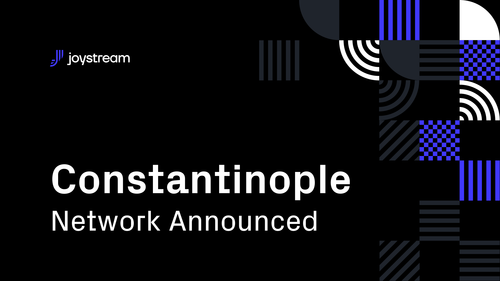

# Post

#### Title

Announcing Constantinople

#### Purpose

Sharing plans for our upcoming Constantinople testnet

#### url

blog.joystream.org/announcing-constantinople/

#### Cover

#### Lead

Constantinople will be a considerably faster release than Rome, focusing more on governance, and designed to create a more realistic incentive structure.

#### Body

---

## What is Constantinople?

Whereas Rome was a great leap forward in terms of creating a dynamic and flexible content directory for the future, the improvements was rather low level, and not very visible and tangible at this stage. Constantinople on the other hand will introduce features that will immediately impact current users, with two major changes affecting the governance and the economic structure of the platform:

* A proposal system that changes the governance of the platform, by shifting the day to day responsibility of monitoring the network and allocating resources to the Voters and the Council
* A new incentive structure, with a fiat pool backing the testnet tokens, creating a more realistic economic system for the platform

#### New Proposal System
Instead of Jsgenesis setting the role parameters, hiring and firing, and running the platforms token economy through a top down approach, Constantinople will introduce a bottom up system where members can make proposal that the Council will vote on

While our current system allows the council to vote on runtime upgrades, the new system will allow proposals to kick storage providers, new tokens for various reasons, setting leads for roles and more.

#### Fiat-Backed Token Model

Another very important change for Constantinople will be the introduction of a fiat-backed compensation system for platform actors. We hope this more dynamic compensation system will help to incentivize and reward community participation, and create a far more realistic economic system that will benefit the project in the long run.

You can read more about the design of this model [here](https://github.com/Joystream/joystream/issues/171).

## Summary and Timeline
Combined, these changes creates a new era of governance and "tokenomics", where all participants will have to make rational economic decisions with their tokens and time, in order to maximize their rewards.

We are aiming to release Constantinople in approximately four weeks, and will in general target shorter and more incremental releases and release cycles going forward.

Further updates will be posted when we are closer to launch, but if you would like to see how we're progressing with development of Constantinople, please take a look at our  [GitHub projects](https://github.com/orgs/Joystream/projects).

---

#### Disclaimer

All forward looking statements, estimates and commitments found in this blog post should be understood to be highly uncertain, not binding and for which no guarantees of accuracy or reliability can be provided. To the fullest extent permitted by law, in no event shall Joystream, Jsgenesis or our affiliates, or any of our directors, employees, contractors, service providers or agents have any liability whatsoever to any person for any direct or indirect loss, liability, cost, claim, expense or damage of any kind, whether in contract or in tort, including negligence, or otherwise, arising out of or related to the use of all or part of this post, or any links to third party websites.

#### Preview

https://blog.joystream.org/p/91f24e6c-827f-4850-8b55-f2a623c92c93/

#### Social media card cover

#### Social media excerpt

The next Joystream testnet, Constantinople, focuses on governance, and attempts to create a more realistic incentive structure.
