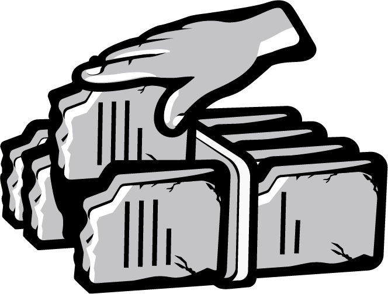
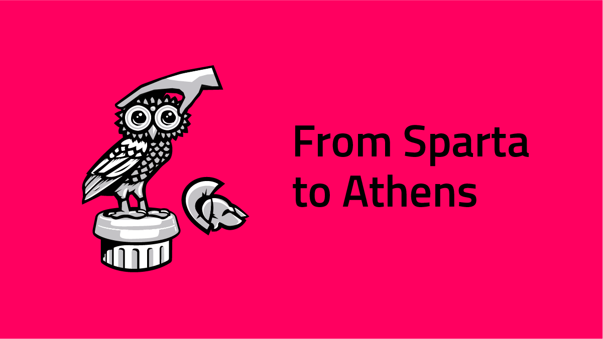

# Post

#### Title

From Sparta To Athens

#### Purpose

Prepare our community for the new testnet, and what it includes of features.

#### url

blog.joystream.org/sparta-to-athens/

#### Cover

#### Lead

Our next testnet, Athens, will include the first version of an on-chain content directory, and opening the new paid position as a storage provider.

Short excerpt:

Athens introduces video content to the platform, and the new `Storage Provider` role.

#### Body
---
New Features
------------

In general, we are aiming at releasing a new testnet ~8 weeks. The size and scope of each release will vary, with some focusing more on end users, and others more on building and optimizing the platform infrastructure.

Also note that the release of Athens will only require a change of the [runtime](https://blog.joystream.org/upgrades/), not trigger a hardfork. Because of the latter, we see no point in resetting the chain this time.

#### User Content

In terms of core platform functionality, building a content distribution system is an important milestone. As a "User governed video platform", we have now already built (a very basic) version of the on-chain governance and the storage and distribution system.

If you have read our [whitepaper](https://github.com/Joystream/whitepaper/blob/master/paper.pdf), or checked out or section on platform jobs and roles, you will realize that of all the different roles we foresee will form the mainnet content distribution system, only storage provider is activated for now. Later testnets will introduce more and more of these roles.

#### Membership

The other feature change visible to the end user is the introduction of platform membership. The concept of memberships might sound like a strange concept for a blockchain, so it should be made clear that a membership is *not* required to transact funds. It will however be required to interact with the platform in any way, such as watching videos, voting or taking a role.

Timeline
--------

We are currently targeting a release in the beginning of April. Before that time, we will at the very least have published:

-   Chenges to the incentive structure for Athens (total payouts going up!)
-   How to become a storage provider on the platform
-   A new "howto" guide covering how install and operate software, and changes to the [UI](https://sparta.joystream.org/apps/#/accounts).

---

#### Disclaimer

All forward looking statements, estimates and commitments found in this blog post should be understood to be highly uncertain, not binding and for which no guarantees of accuracy or reliability can be provided. To the fullest extent permitted by law, in no event shall Joystream, Jsgenesis or our affiliates, or any of our directors, employees, contractors,  service providers or agents have any liability whatsoever to any person  for any direct or indirect loss, liability, cost, claim, expense or  damage of any kind, whether in contract or in tort, including negligence, or otherwise, arising out of or related to the use of all or  part of this post, or any links to third party websites.

#### Preview

https://blog.joystream.org/p/ed2aa80e-df3e-4517-ba81-81008b3d897a/

#### Social media card cover

#### Social media excerpt

Athens introduces video content to the platform, and the new `Storage Provider` role.
