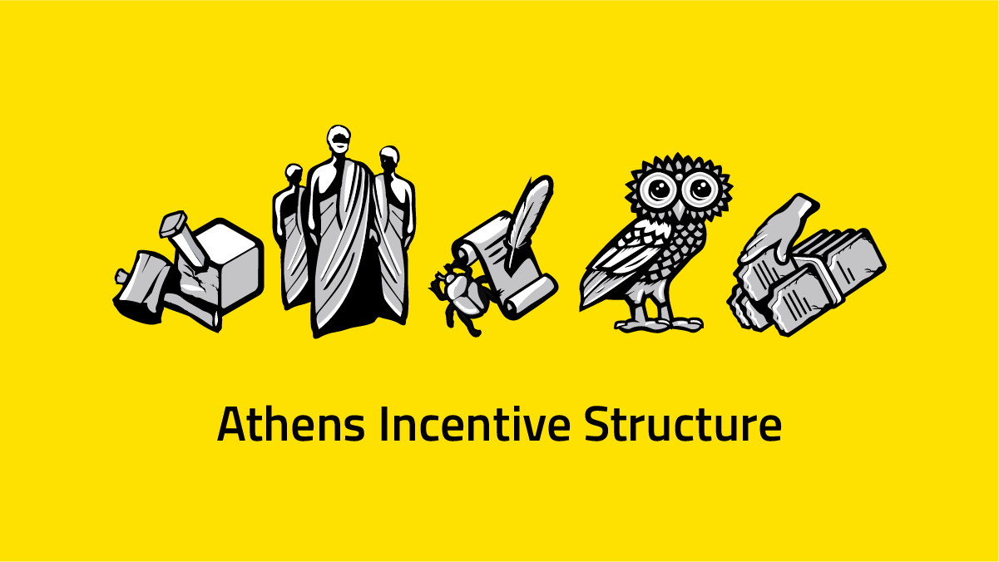

# Post

#### Title

The Athens Incentive Structure

#### Purpose

Explain the new incentive structure of Athens.

#### url

blog.joystream.org/athens-incentives/

#### Cover

<p align="center"></p>

#### Lead

Like we have done for Sparta, we will pay users in monero to participate on our testnets. This blog post will explain to both existing and new users what they can do, and how much they can earn, alongside some lessons we learned.

Short excerpt:

A new testnet includes a new incentive structure.

#### Body

---
<p align="center"></p>


TL;DR
-----

-   `Storage Providers` can earn $10 per week, plus $0.025/GB per week
-   `Validators` are competing for $30 per week
-   `Council Members` are paid $8 for getting elected, with a $5 bonus
-   `Bug Reporters` can earn up to $20/$100 for an `Issue`/ `PR`

Who, Why and What?
------------------

As for Sparta, anyone* **who** wants to can participate on Athens and earn monero. We assume this will be the case for future testnets as well.\
*There is however some extra help and guidance for those that ask for it in our [Rocket.Chat](https://chat.joystream.org/home) and [Telegram](https://t.me/joinchat/CNyeUxHD9H56m3e_44hXIA).

The philosophy behind **why** was discussed in detail in a previous [post](https://blog.joystream.org/pay-for-play/). In short, we are paying to prepare active participants for an autonomous platform, and test the incentive structure with "real money".

**What** you can do to qualify for getting paid on Sparta is described below.

Note that in order for us know what address to pay, you must tie your Joystream account to your monero address monero address by putting your XMR address in the `My memo` tab under `My Accounts` sidebar. (Note that this feature this not work with zero balance, and currently not when you are staking to be/are a Validator.)

```
# Only the part in the line below goes in the memo:
"4or8YourXmrAddressInDoubleQuotesAndNothingElse"
```

For our convenience, we ask you to use a regular address or sub-address (95 char) instead of the (106 char) payment-ID style address. The latter forces us to make multiple transactions instead of just one.

#### Paid Roles

For Athens, a brand new role will be activated - `[Storage Provider](https://blog.joystream.org/athens/#storage-provider)`. As this is also a more complex role in nature, the requirements, difficulty and payout will be higher than for the other roles. In addition to this, all three roles from Sparta will be compensated with slightly tweaked (in practice higher) rewards. Click the links below to jump straight to your prefer

-   `[Validator](https://blog.joystream.org/athens/#validator)`
-   `[Council Member](https://blog.joystream.org/athens/#council-member)`
-   `[Bug Reporter](https://blog.joystream.org/athens/#bug-reporter)`

Storage Provider
----------------

<p align="center"></p>

You can't have a video platform without videos, so someone has to take the role storing the data. In the future, this role will be highly specialized on the one key thing implied by the role title, whereas in Athens, it will in practice also entail the future `Bandwidth Provider` role, and also act as the liason while receiving the content in the first place.

Unlike `Validators` that can come and go without too much friction (while the size of the blockchain is small, and little staking is required), a new `Storage Provider` will need to replicate the entire content directory*, thus creating some delay and friction to get onboarded.\
*We assume the demand for storage to be  limited at this early stage.

In addition to a weekly payout of $10, you will earn a $0.025/GB/week calculated on an average basis. Only the 6 highest staked `Storage Providers` that keeps a full copy and provides continues service for at least 24h will qualify for the reward. We will try our best to catch any cheaters, so at the very least you must avoid getting caught! Payouts will be made every Monday at ~11:00GMT.

Validators
----------

<p align="center"></p>

**Compete for $30 per week**

In proof of stake systems, block producers, or Validators, are typically paid a fixed amount for each block produced. While Sparta has been running, we have learned that the interest for being a `Validator` was higher than we anticipated, so we are increasing the `[validator_count](https://github.com/Joystream/substrate-node-joystream/blob/03f87d875098511caea98d42b233bf12e3d66999/src/chain_spec.rs/#L164)` from 10 to 20. To avoid reducing individual rewards too much, we are increasing the pool from $20 to **$30 per week**.

```
blocktime = 6
weekly_reward = 2500
seconds_in_week = 60*60*24*7

blockreward = (weekly_reward * blocktime)/seconds_in_week
print(blockreward)

----

0.03
```

The number - 0.03 cents per block - seems a bit underwhelming, but validation requires little effort for the user after setup, and with armv7 binaries, it should be cheap to run! Payouts will be made every Monday at ~11:00GMT.

Council Member
--------------

<p align="center"></p>

**Earn $10 per Election Cycle**

Council Members are elected by the stakeholders in the system to act in the interest of their constituency. Somewhat simplified, the council will allocate the platforms resources, and hire executive personnel to run the day to day.

We are looking at how to best incentivize them to act in the platforms long term interest. As this position generated less interest than we anticipated, we are tweaking the incentives by increasing the payout to get elected from $5 to $8.

If during you term a proposal to upgrade the runtime is submitted by the `sudo` key, `5EVekYLRygtpiyfRMqwjYsSELnHPso5qBAmiegUU95SvZMAv` anyone that votes yes will receive a bonus worth $5. A detailed explanation the election cycle and responsibilities can be found [here](https://blog.joystream.org/sparta/#council-member).

During the `Announcement` and `Voting` stage, you should include some information about why you should get elected in your `memo` field. If you do get elected, make sure to change the `memo` field to your monero address in order to get your reward. Payouts will occur at ~10:00GMT the day after the election/vote.

#### Bug Reporter

<p align="center"></p>

**Earn up to $20 for reporting, and $100 for fixing bugs.**

Unlike the Validators and Council Members, the bug bounty payments will be somewhat subjective. Long term, such decisions will be resolved by the platform, so in future testnets these payouts will at least partially be made by the Council.

We saw little interest in this role for Sparta, and only one community member reported `Issues` in the hopes of getting rewarded. Jsgenesis contracted this person to perform a more in depth investigation, but we still hope to generate more interest.

To report an `Issue` or make a `Pull request` go to the [node repo](https://github.com/Joystream/substrate-node-joystream), the [UI repo](https://github.com/Joystream/apps/tree/joystream), the [storage node repo](https://github.com/Joystream/storage-node-joystream) or the [runtime-repo](https://github.com/Joystream/substrate-runtime-joystream). Based on the *importance and quality* of the issue/PR, the Jsgenesis team will decide on the rewards.

-   For issues, the reward will range up to $20
-   For a PR, the reward can range up to $100

The quality of an issue can be measured from the level of details in general, like how to reproduce, pasted log outputs, etc. In terms of PRs, simply copying new features implemented on substrate will not be rewarded unless the PR includes changes that was required for compatibility on Joystream.

The contributor must include either their Joystream or monero address when submitting the issue/PR. If you choose the former, you must then make sure the add your monero address to the `memo` field of your account as explained at the beginning of this post.

---

#### Disclaimer

All forward looking statements, estimates and commitments found in this blog post should be understood to be highly uncertain, not binding and for which no guarantees of accuracy or reliability can be provided. To the fullest extent permitted by law, in no event shall Joystream, Jsgenesis or our affiliates, or any of our directors, employees, contractors,  service providers or agents have any liability whatsoever to any person  for any direct or indirect loss, liability, cost, claim, expense or  damage of any kind, whether in contract or in tort, including negligence, or otherwise, arising out of or related to the use of all or  part of this post, or any links to third party websites.

#### Preview

https://blog.joystream.org/p/eb8aa2b6-f63b-4606-82a4-136ca50b799d/

#### Social media card cover

<p align="center"></p>

#### Social media excerpt

A new testnet includes a new incentive structure.
