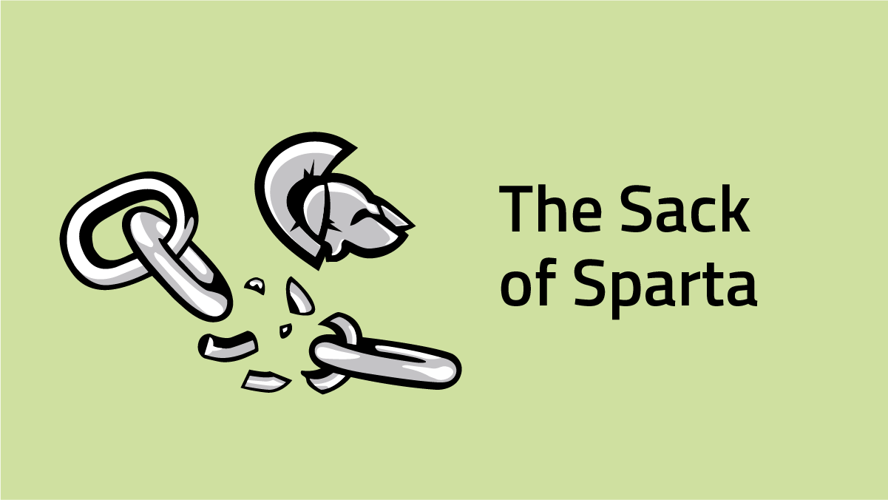

# Post

#### Title

The Sack of Sparta

#### Purpose

Make a public statement addressing why `Sparta` went down, what we have/are doing about it, and how it affects the community.

#### url

blog.joystream.org/sparta-sacked/

#### Cover

<p align="center"></p>

#### Lead

Due to a bug, Sparta got rekt on March 29th. Somewhat ironically, a [hardfork](https://blog.joystream.org/upgrades/) and chain reset seems like the best option. `Validators` and `Council Members` will be [compensated](https://blog.joystream.org/p/468c3a4f-42bb-41fb-b371-c10a643cc92f/blog.joystream.org/sparta-sacked/#pay) for their troubles.

#### Body

---
What Happened?
--------------

At ~1200GMT, all the nodes crashed with the following message:

```
Thread 'ImportQueueWorker' panicked at 'Externalities not allowed to fail within runtime: "Trie lookup error: Database missing expected key: 0x5ef2a145ff5027f112393fd2266bfdd3f230abf7079985161df61f6b9dd21da9"', src/libcore/result.rs:1009

This is a bug. Please report it at:

	https://www.joystream.org
```

The error was traced back to a known [bug](https://github.com/paritytech/substrate/issues/1733) with `trie-* v0.11.0` libraries in the `Substrate v0.9.1` node template we had used. The issue was addressed in `Substrate` with this [PR](https://github.com/paritytech/substrate/pull/2130),  but as it's difficult to stay synced `upstream` (referring to the [substrate repo](https://github.com/paritytech/substrate)) while developing our own features, we had prioritized the former.

We could have tried to salvage the chain by changing the dependencies from `trie-* v0.11.0` to `trie-* v0.12.0` and force everyone to upgrade their nodes. Without proper testing however, chances are we would quickly have discovered another breaking change.

Next step
---------

We will instead focus our efforts on getting everything up to speed for our next testnet, Athens, that was scheduled to be released early March anyway. Our intentions was to only upgrade the [runtime](https://blog.joystream.org/upgrades/#runtime) through a council vote and not require any upgrades of the node software itself. After careful deliberation, and advice from the always helpful Substrate developer team, we have decided its best to upgrade the nodes, complete the new features, test and release.

Validators and Council Member Payouts
-------------------------------------

To help ease the pain of our great community members that has participated on Sparta, we will try and make everyone "whole".

#### Council Members

The second [council election](https://sparta.joystream.org/apps/#/council/members) had just concluded before the network went down. All members will be paid out tomorrow, and will also receive the bonus they would have received had the testnet reached its intended destination.

#### Validators

As it must be assumed that the same group would have kept on fighting to produce blocks, we will double the payout for the blocks that was produced before we went down.

Stay Tuned for Athens
---------------------

A new blog post about Athens will be released in the next few days, introducing the new features and paid roles. In the meantime, you can check out our [github](https://github.com/JoyStream/), where all plans, project management, software, assets, etc. are being shared to the world. More about this in future posts.

---

#### Disclaimer

All forward looking statements, estimates and commitments found in this blog post should be understood to be highly uncertain, not binding and for which no guarantees of accuracy or reliability can be provided. To the fullest extent permitted by law, in no event shall Joystream, Jsgenesis or our affiliates, or any of our directors, employees, contractors,  service providers or agents have any liability whatsoever to any person  for any direct or indirect loss, liability, cost, claim, expense or  damage of any kind, whether in contract or in tort, including negligence, or otherwise, arising out of or related to the use of all or  part of this post, or any links to third party websites.

#### Preview

https://blog.joystream.org/p/468c3a4f-42bb-41fb-b371-c10a643cc92f/

#### Social media card cover

<p align="center"></p>

#### Social media excerpt

Due to an issue, Sparta got rekt on March 29th. Validators and Council Members will be compensated for their troubles.
