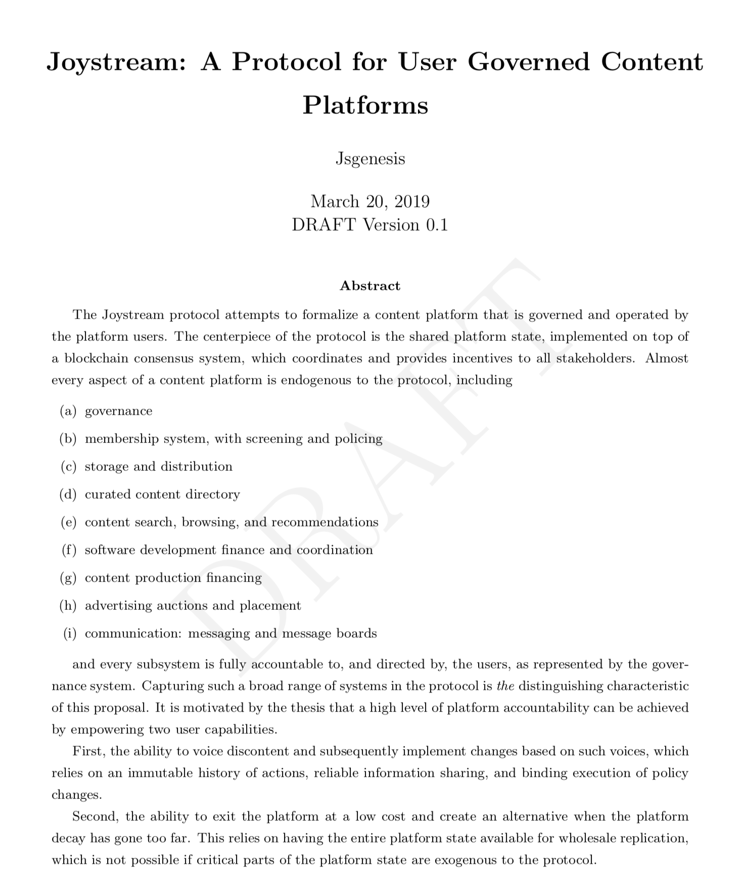

# Whitepaper Published

We are very pleased to share the first public draft of our [whitepaper](https://github.com/Joystream/whitepaper/blob/master/paper.pdf). It is an excellent starting place for getting a concrete indication of where we are going technically, but be very aware that this is a draft document which will be updated on an ongoing basis, as the  preface states

> This is an evolving document meant as a basis for an iterative review, technical specification and testing, and revised versions will be developed on the basis of that process. Multiple aspects of the protocol are still subject to active research, and any part of the current design may be amended or entirely abandoned as a result of subsequent considerations.

Have a look, and please get back to us with questions, fixes and criticism!

