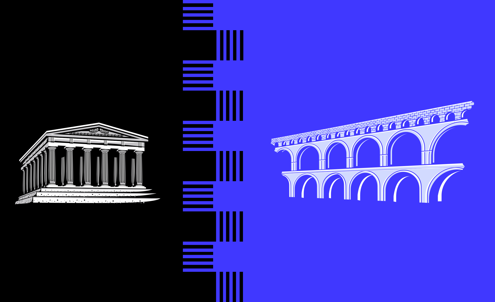

# Post

#### Title

From Acropolis To Rome

#### Purpose

Let our community know about the transition between Acropolis and Rome.

#### url

blog.joystream.org/from-acropolis-to-rome/

#### Cover

#### Lead

We bid farewell to Acropolis to welcome our new testnet, Rome!

#### Body

After almost nine months of experimentation by testnet participants on Acropolis, we are now ready to move on to our latest release, codenamed Rome, which incorporates a variety of new features.

The Plan
--------

The main aspect of the release process for participants to be aware of is our intention to "kill" the Acropolis chain this Friday (13th March). The snapshot for Acropolis was taken at block number `4,718,300`.

We will migrate all memberships and forum posts (but not media content) from Acropolis over to Rome and each existing membership will be given a small starting balance of `2000JOY`. If everything goes according to plan, the new chain for Rome will be launched on Monday (16th March) at approximately midday.

All `Validators` and `Storage Providers` will be booted and will need to get set up on the new chain once live. While the requirements for being a storage provider are unchanged, there will be some changes in the method for validating on the network. More information on how to validate on Rome will be available shortly.

More information on the release timeline is available in the GitHub issue here:
https://github.com/Joystream/joystream/issues/103

What's New In Rome?
-------------------

Rome's main additions are the roles of `Content Curator` and `Content Creator`. We have also introduced the concept of channels, allowing one membership to create a selection of different channels on which to host content. Many other changes have been made to allow for easier navigation and to improve the user experience.

We will be releasing information on Rome's incentive structure soon. This will provide rewards for validation, council membership and content storage (as before) but will also introduce a compensation structure for content creation and curation.

After Rome
----------

Once Rome is released, we will immediately begin development of our subsequent testnet release, codenamed Constantinople. Stay tuned to our blog and other communications channels for more updates on this.

* * * * *

#### Disclaimer

All forward looking statements, estimates and commitments found in this blog post should be understood to be highly uncertain, not binding and for which no guarantees of accuracy or reliability can be provided. To the fullest extent permitted by law, in no event shall Joystream, Jsgenesis or our affiliates, or any of our directors, employees, contractors,  service providers or agents have any liability whatsoever to any person  for any direct or indirect loss, liability, cost, claim, expense or  damage of any kind, whether in contract or in tort, including negligence, or otherwise, arising out of or related to the use of all or  part of this post, or any links to third party websites.

* * * * *

#### Preview

https://blog.joystream.org/p/7aa0e4fc-a848-45bd-915c-2fdbf8bd6bfd/

<!--- REPLACE LINK ABOVE ON PUBLICATION --->

#### Social media card cover

#### Social media excerpt

Learn about the transition from Acropolis to Rome.
