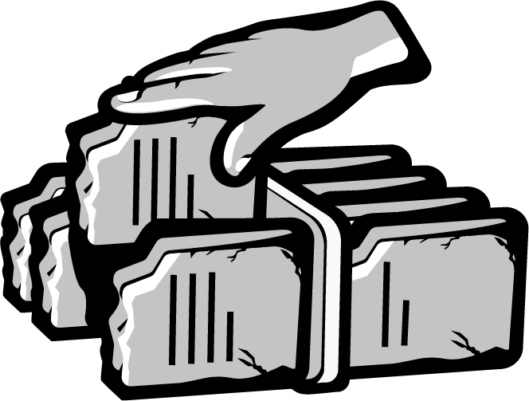

# Post

#### Title

From Sparta To Athens

#### Purpose

Prepare our community for the new testnet, and what it includes of features.

#### url

blog.joystream.org/sparta-to-athens/

#### Cover

#### Lead

Athens will introduce the first version of a content distribution system on the platform. In addition to the old [paid roles](https://blog.joystream.org/sparta-incentives-structure/), the new `Storage Provider` role is getting activated.

Short excerpt:

Athens introduces video content to the platform, and the new paid `Storage Provider` role.

#### Body
---

    
    
Like Sparta, participants on Athens can earn Monero

## New Features

In general, we are aiming at releasing a new testnet ~8 weeks. The size and scope of each release will vary, with some focusing more on end users, and others more on building and optimizing the platform infrastructure.

In most cases, we will aim at voting through [runtime](https://blog.joystream.org/upgrades/) upgrades, instead of hardforks and/or chain resets. Due to the bug that took down [Sparta](https://blog.joystream.org/sparta-sacked/), Athens will require upgrading the full node software, and start from a new genesis block.

#### User Content

In terms of core platform functionality, building a content distribution system is an important milestone. As a "User governed video platform", we have now already built (a basic) version of the on-chain governance and the storage and distribution system.

If you have read our [whitepaper](https://github.com/Joystream/whitepaper/blob/master/paper.pdf), you will realize that of all the different roles we foresee will form the mainnet content distribution system, only `Storage Provider` is activated for now. As development progresses, future testnets will introduce more and more of these roles.

#### Membership

The other feature change visible to the end user is the introduction of platform `Membership`. The concept of memberships might sound strange for a blockchain, so it should be made clear that a `Membership` is *not* required to transact funds. It will however be required for most interaction with the platform, such as watching videos, voting and most roles.

## Timeline

We are currently [targeting release](https://github.com/Joystream/joystream/tree/master/testnets/athens#live-milestones) on the 10th of April. Before that time, we will at least have published the following information:

-   Changes to the incentive structure for Athens (total payouts going up!)
-   How to become a `Storage Provider` on the platform
-   How to get a `Membership` to the platform.
-   Updated guides on how to become a `Validator`
-   Any additional information guides required to use the UI.

---

#### Disclaimer

All forward looking statements, estimates and commitments found in this blog post should be understood to be highly uncertain, not binding and for which no guarantees of accuracy or reliability can be provided. To the fullest extent permitted by law, in no event shall Joystream, Jsgenesis or our affiliates, or any of our directors, employees, contractors,  service providers or agents have any liability whatsoever to any person  for any direct or indirect loss, liability, cost, claim, expense or  damage of any kind, whether in contract or in tort, including negligence, or otherwise, arising out of or related to the use of all or  part of this post, or any links to third party websites.

#### Preview

https://blog.joystream.org/p/ed2aa80e-df3e-4517-ba81-81008b3d897a/

#### Social media card cover

#### Social media excerpt

Athens introduces video content to the platform, and the new paid `Storage Provider` role.
