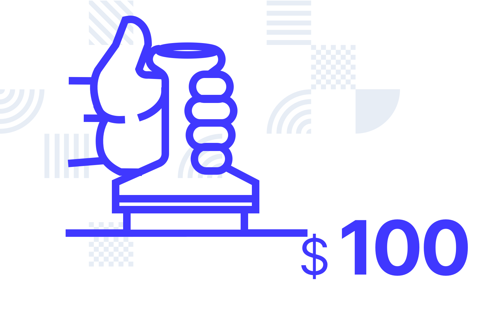
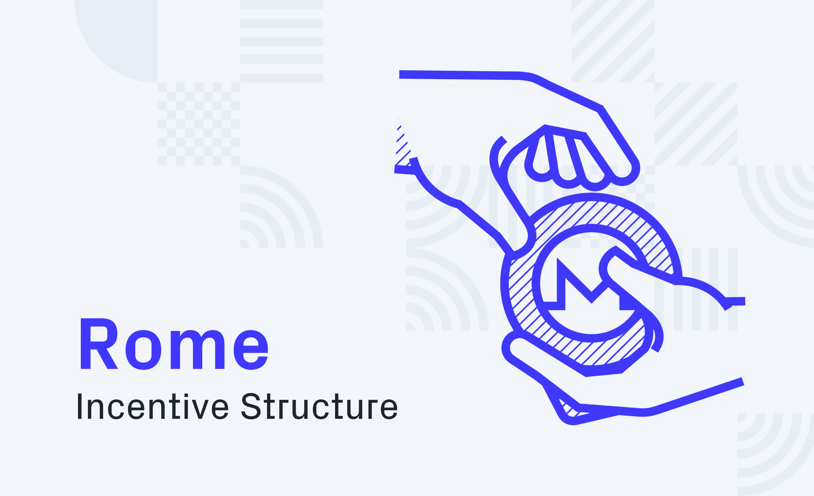

# Post

#### Title

The Rome Incentive Structure

#### Purpose

Inform our community about Rome's incentive structure.

#### url

blog.joystream.org/rome-incentives/

#### Cover

<p align="center"></p>

#### Lead

Rome offers a new incentive structure for our testnet participants.

#### Body

As with Sparta, Athens and Acropolis we plan to pay users in monero (XMR) to participate on our upcoming testnet release, codenamed Rome. Our fifth testnet ambitiously introduces two new paid roles which we are extremely excited about!

Rome will differ slightly from Acropolis in that it will have dynamic incentives in order to allocate resources more efficiently, ensure good uptime for validators and storage providers, promtote responsiveness and activity by content creators and curators and to help prepare for our next testnet, which will shift the responsibility of setting rewards from Jsgenesis to the council. This means that all of the compensation structures listed below are subject to review at any time.

Rome is set to be launched on Monday 16th March. Read more about the procedure for the release [here](https://blog.joystream.org/from-acropolis-to-rome/). Updated guides for testnet roles will be released on Sunday 15th March. Prospective participants should familiarize themselves with these guides before launch for the best chance of winning a spot in one of these competitive roles.

Executive Summary
-----------------

- `Content Creators` receive up to $0.60 per qualifying item of content uploaded
- `Content Curators` earn either $30 or $60 per week, depending on workload
- `Storage Providers` will share $120 per week, plus $0.03/GB per week
- `Validators` are competing for their share of $50 per week
- `Council Members` are paid $10 for getting elected, with a $10 bonus
- `Bug Reporters` can continue to earn monero for reporting and/or fixing bugs

Who, Why, What and How?
-----------------------

As with previous incentivized testnets, anyone who wants to can participate on Rome and earn monero, but there is some extra help and guidance for those that ask for it in our [Telegram group](https://t.me/JoyStreamOfficial). 

The philosophy behind why was discussed in detail in a [previous post](https://blog.joystream.org/pay-for-play/). In short, we are paying to prepare active participants for an autonomous platform and test the incentive structure with "real money".

What you can do to qualify for getting paid on Rome is described below. More information, guides on how to get setup and extra support can be found in our helpdesk repo on GitHub.

Participants should also note that some important changes to the faucet will take place upon the launch of Rome. To prevent Sybil attacks, tokens will be made available primarily through our communication channels (including Telegram, Twitter and our mailing list). The faucet will continue to operate, but will offer considerably lower payouts.

Paid Roles
----------

- Content Creator
- Content Curator
- Storage Provider
- Validator
- Council Member
- Bug Reporter

If you find one or more of these roles interesting, or want to learn about future roles on the network, we encourage you to visit the new [roles](https://joystream.org/roles) section on our website. Here you can browse through them and get a sense of what they will mean to the network, along with responsibilities and requirements.

You can also sign up for role specific newsletters that will keep you updated on development and incentives!

Content Creators
----------------


<i>Compete for $220 per week as a content creator</i>

When the Joystream mainnet is live, `Content Creators` will play a fundamental role within the platform's ecosystem. This is because they will be responsible for creating and uploading the enormous variety of different content types and genres which we believe will allow Joystream to grow into a successful decentralized media platform.

For the Rome testnet, we plan to pay a flat-rate Monero reward for every piece of content uploaded by `Content Creators` (with a different rate for each content type). We will also pay a $1 bonus on top of this rate for the each 25 best pieces of content that are uploaded every week to encourage higher quality uploads. A separate $1 bonus will be paid for the first 25 items of "original"* content every week. The maximum weekly incentive pool of $200 will be divided between these two categories of incentive.

* Original here means creative work that you created yourself and own exclusive the rights to.

Prospective `Content Creators` should also be aware that we will only pay the item reward for content with complete metadata and which follows the set-out requirements for each content type (to be released at a later date).

The `Content Curators` (see below) will be incentivized to find content with incorrect metadata and will likely remove it from the content directory. In these cases, content creators will not be paid. Multiple spam uploads which represent a burden to moderate for the `Content Curators` may even be penalized and result in deductions on payouts due for qualifying content uploads on your content creator profile.

Uploading illegal or copyrighted content will result in a disqualification from payouts. It will also result in the takedown of content, potentially slashing of funds, and the deletion of your channel.

We will provide `Content Creators` with a list of sources for safe and non-copyrighted material which can be uploaded as part of this testnet and will qualify for the payments discussed above and laid out in the table below.

### Rewards based on content type

| CONTENT TYPE | MAXIMUM PAYMENT PER ITEM | MAXIMUM WEEKLY POOL |
| --- | --- | --- |
| Short Video (Standard) | $0.35 per video* | $70 |
| Long Video (Standard) | $0.50 per video* | $100 |
| Best Content (Bonus) | $1 per item* | $25 |
| Original Content (Bonus) | $1 per item* | $25 |

*It's important to note that the rewards listed in the table are maximums. Short videos are under four minutes and long videos exceed four minutes in length.

For example, if more than 200 `short videos` are uploaded in a week the reward per
short video item will be reduced for that week. In the case of 400 `short videos` being
uploaded, the reward will be halved to $0.175 per file ($70 ÷ 400). For 800
`short videos` in a week the reward would be $0.0875 and so on.

Basically, the payment per item is constant until the number of items in
category multiplied by maximum payment per item exceeds the maximum weekly
pool. We have chosen this reward structure in order to incentivize users to
upload a variety of different content types on Rome.

Payouts for this role will be made every Monday at ~11:00GMT.

Content Curators
----------------


<i>Earn your share of $375 per week</i>

`Content Curators` will one day be essential for ensuring that the petabytes of media items uploaded to Joystream are formatted correctly and comprehensively monitored and moderated. Our upcoming testnet allows this content monitoring to take place by giving users who are selected for the role administrative access to the Joystream content directory to make changes where necessary.

We will have five slots available for `Content Curators` when Rome is launched. They will need to apply to the `Content Curator Lead` (a `sudo` role operated by [Jsgenesis](https://jsgenesis.com/)) and will have their application assessed by this lead before being added as a curator for a default term of one week.

If successful in their application, curators will be rewarded with a flat reward of `$30` per week, resulting in a maximum pool of `$150` if all five content curators are signed up. If there are less than 100 pieces of content uploaded in the week in which a curator is operating, the individual payout will be reduced to `$15` for that week, resulting in a total pool of `$75`.

There will also be two bonuses of `$20` and `$10` per week for the two most active curators respectively in terms of monitoring the items in the content directory for compliance with our metadata, category and content rules. These bonuses will be awarded by the `Content Curator Lead`. In total, during a typical week, `Content Curators` will be competing for their share of `$375` in XMR.

Inactive malicious curators will be slashed and booted by the `Content Curator Lead`.

Payouts will be made every Monday at ~11:00GMT.

Storage Providers
-----------------


<i>Compete for $120 per week, plus bonus for bandwidth and storage</i>

Unlike `Validators` that can come and go without too much friction (at least for now), a new `Storage Provider` replicates the entire content directory. As a consequence, the platform needs some stability for this role to avoid a poor user experience, or worse, loss of data. After migrating to the Rome testnet, the users that currently hold the role will get "kicked" out, and will have to sign up again if they still want to keep their role.

Up to eight `Storage Providers` that keep a full copy of the content directory and provide continuous service for at least 24h will compete for `$120 per week`. In addition,  you will earn `$0.03/GB/week` (of data in the content directory) calculated on an average basis. You will also need a domain to point to your node, so unless you already own one (that you don't mind using), you will need to buy one.

We will be closely monitoring `Storage Providers` for Rome (more so than we did for Acropolis) so make sure your node is performing optimally to avoid being booted. `Storage Providers` should also be aware that the variable part of the compensation structure is likely to be reviewed after launch (up or down) to make sure that providers are fairly compensated for their efforts.

Payouts will be made every Monday at ~11:00GMT.

A detailed guide to setting up the node [can be found here](https://github.com/Joystream/helpdesk/tree/master/roles/storage-providers).

Validators
----------



<i>Compete for $50 per week</i>

In proof of stake systems, block producers, or `Validators`, are typically paid a fixed amount for each block produced. For Rome, the payout pool will remain the same at `$50` per week shared between all `Validators` on the network.

```
blocktime = 6
weekly_reward = 5000
seconds_in_week = 60*60*24*7

blockreward = (weekly_reward * blocktime)/seconds_in_week
print(blockreward)

----

0.05

```

The number - 0.05 cents per block - seems a bit underwhelming, but validation requires little effort for the user after setup, and blocks come in every 6secs. With armv7 binaries or low-end VPS nodes, it should be cheap to run! A detailed guide to setting up the `Validator` node and settings can be found [here](https://github.com/Joystream/helpdesk/tree/master/roles/validators).

After migrating to the Rome testnet, the users that currently hold the role will get "kicked" out, and will have to sign up again if they still want to keep their role.

Payouts will be made every Monday at ~11:00GMT.

Council Members
---------------


<i>Earn $10 per election cycle</i>

Council Members are elected by the stakeholders in the system to act in the interest of their constituency. Somewhat simplified, the Council will allocate the platform's resources, and hire executive personnel to run the day to day. We are looking at how to best incentivize them to act in the platform's long-term interest.

If during you term a proposal to upgrade the runtime is submitted by the `sudo` key, `5CJzTaCp5fuqG7NdJQ6oUCwdmFHKichew8w4RZ3zFHM8qSe6` anyone that votes `yes` will receive a bonus worth $10. A detailed explanation the election cycle and responsibilities can be found [here](https://github.com/Joystream/helpdesk/tree/master/roles/council-members).

During the `Announcement` and `Voting` stage, you should include some information about yourself, and why you should get elected in your `memo` field. If you do get elected, make sure to change the `memo` field to your monero address in order to get your reward.

Payouts will occur at ~11:00GMT the day after the election/vote.

Bug Reporters and Builders
--------------------------


<i>Earn monero for reporting bounties or fix bugs!</i>

Unlike the `Validators` and `Council Members`, the bug bounty payments will be somewhat subjective. Long term, such decisions will be resolved by the platform, so in future testnets these payouts will at least partially be made by the Council.

We also have a [bounties repo](https://github.com/Joystream/bounties) where you can find specific tasks and their rewards, and we will add more bounties and evolve the system as we grow. In addition to the bounties we propose, we are always looking for suggestions for bounties from the community.

If you find a bug, potential improvement, or just an idea, there are a couple of ways to earn your reward:

### Report a software bug

Go to the applicable technical repo(s), eg. [node repo](https://github.com/Joystream/substrate-node-joystream), [Pioneer repo](https://github.com/Joystream/apps/tree/joystream),  [storage node repo](https://github.com/Joystream/storage-node-joystream), [runtime-repo](https://github.com/Joystream/substrate-runtime-joystream), etc. and make an `Issue`. You will be compensated based on the importance and "quality", the latter of which is measured from the level of details in general, like how to reproduce, pasted log outputs, etc.

### Errors in the helpdesk guides (or a non-code repo)

If you find something missing, inaccurate or poorly described, either report an `Issue`, or even better, make a `Pull request` in the [helpdesk repo](https://github.com/Joystream/helpdesk).

If what you have found is from another non-code repo, eg. [landing repo](https://github.com/Joystream/joystream), [communications repo](https://github.com/Joystream/communications),  [bounties repo](https://github.com/Joystream/bounties), etc. it will most likely be covered by [this bounty](https://github.com/Joystream/bounties/issues/3). Note that the bar here is quite low (grammar, dead links, etc.) so more significant findings can lead to a lot larger payouts.

### Fix a software bug, or add/improve a feature

If you want, you can just make a PR directly, and your contribution will be compensated. If it's an extensive job though, it would be best for all parties if you propose a bounty yourself as outlined [here](https://github.com/Joystream/bounties#proposals). We can then agree on terms in advance, so no one will be left disappointed.

### Collect your bounty

The contributor must include either their Joystream or monero address when submitting the issue/PR. If you choose the former, you must then make sure the add your monero address to the `memo` field of your Joystream address.

* * * * *

#### Disclaimer

All forward looking statements, estimates and commitments found in this blog post should be understood to be highly uncertain, not binding and for which no guarantees of accuracy or reliability can be provided. To the fullest extent permitted by law, in no event shall Joystream, Jsgenesis or our affiliates, or any of our directors, employees, contractors,  service providers or agents have any liability whatsoever to any person  for any direct or indirect loss, liability, cost, claim, expense or  damage of any kind, whether in contract or in tort, including negligence, or otherwise, arising out of or related to the use of all or  part of this post, or any links to third party websites.

#### Preview

http://151.236.222.69/p/c8c9f496-5808-4cf4-9b96-10dcf192877c/

#### Social media card cover

<p align="center"></p>

#### Social media excerpt

Rome offers a new incentive structure for our testnet participants.
