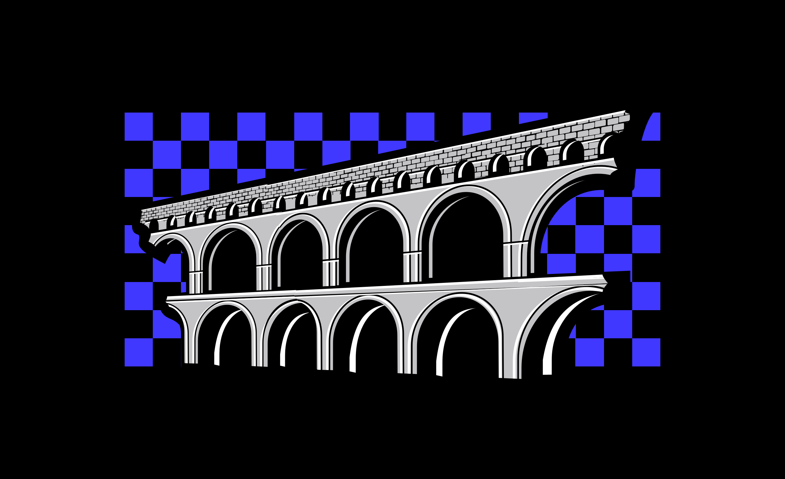
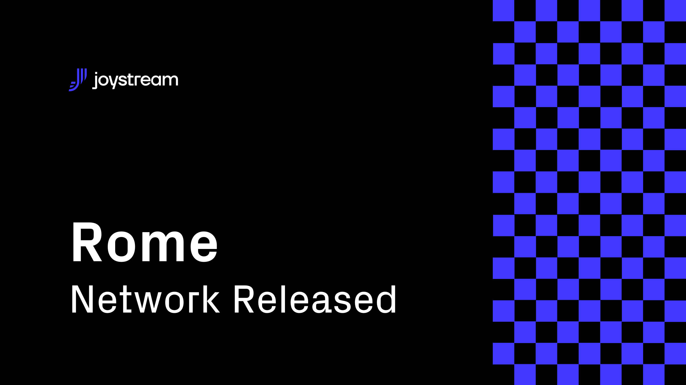

# Post

#### Title

Rome Released

#### Purpose

Inform our community about Rome's release.

#### url

blog.joystream.org/rome-released

#### Cover

#### Lead

After launching the new chain for our latest testnet, Rome is live with a new content directory, new roles and a new incentive scheme!

#### Body

Chain Reset
==

As stated in [here](https://blog.joystream.org/from-acropolis-to-rome/), Rome is launched on a new chain. Memberships and the forum have been migrated, but apart from that, it's a fresh start. This means all `Validators` and `Storage Providers` that wants to continue in their roles must change their setup. Guides to get started can be found [here](https://github.com/Joystream/helpdesk).

New Roles
--

Rome offers one completely new role as `Content Curators`, and adds incentives for `Content Creators`.

Get Paid to Participate
==

As for previous testnets, Rome has it's own incentive scheme. Unlike previous testnets however, we are introducing a dynamic system where slots and rewards will be subject to a weekly review. For the next testnet, this will be controlled by the council, but for Rome, it will be decided by Jsgenesis. Learn more about the incentives [here](https://blog.joystream.org/rome-incentives/). The specifics of this are also available in our [helpdesk repo](https://github.com/JoyStream/helpdesk).

The following roles qualify for rewards`*`:

1.  `Validators` will split $100 per week based on blocks found.
2.  `Council Members` will receive $10 to get elected, + bonus if called to vote.
3.  `Storage Providers` will split $120 per week based on uptime, + a larger bonus for content stored.
4.  `Content Creators` will complete for $250 per week to upload content.
5.  `Content Curators` will each share $180 per week plus performance bonuses.
6.  `Builders and Bug Reporters` can collect bounties for finding or fixing bugs.

`*`Note that the stated rewards applies to the first week only

Get Started
==

If you just want to have a look at the new testnet, go [here](http://testnet.joystream.org/). If you need any help getting started, we ask you to consult our [helpdesk repo](https://github.com/JoyStream/helpdesk) first. If you have further questions, post them as `Issues` there, or ask in our [Telegram](https://t.me/JoyStreamOfficial)!

With a lot of changes since our last testnet, this applies just as much to old and new participants.

#### Disclaimer

All forward looking statements, estimates and commitments found in this blog post should be understood to be highly uncertain, not binding and for which no guarantees of accuracy or reliability can be provided. To the fullest extent permitted by law, in no event shall Joystream, Jsgenesis or our affiliates, or any of our directors, employees, contractors,  service providers or agents have any liability whatsoever to any person  for any direct or indirect loss, liability, cost, claim, expense or  damage of any kind, whether in contract or in tort, including negligence, or otherwise, arising out of or related to the use of all or  part of this post, or any links to third party websites.

#### Preview

blog.joystream.org/p/1a79a5af-786a-4978-8f8f-ad15dcf56bd5/

#### Social media card cover

#### Social media excerpt

After launching the new chain for our latest testnet, Rome is live with a new content directory, new roles and a new incentive scheme!
